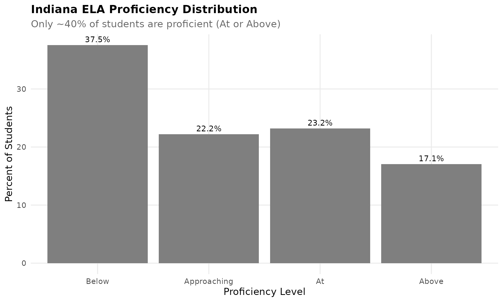
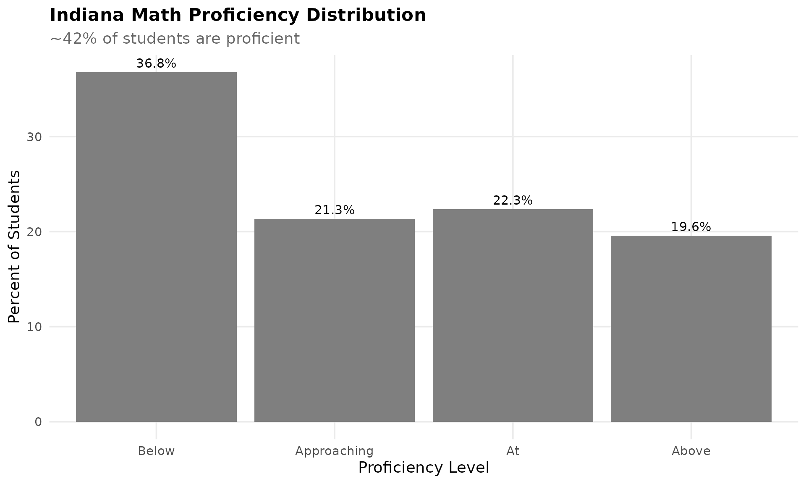
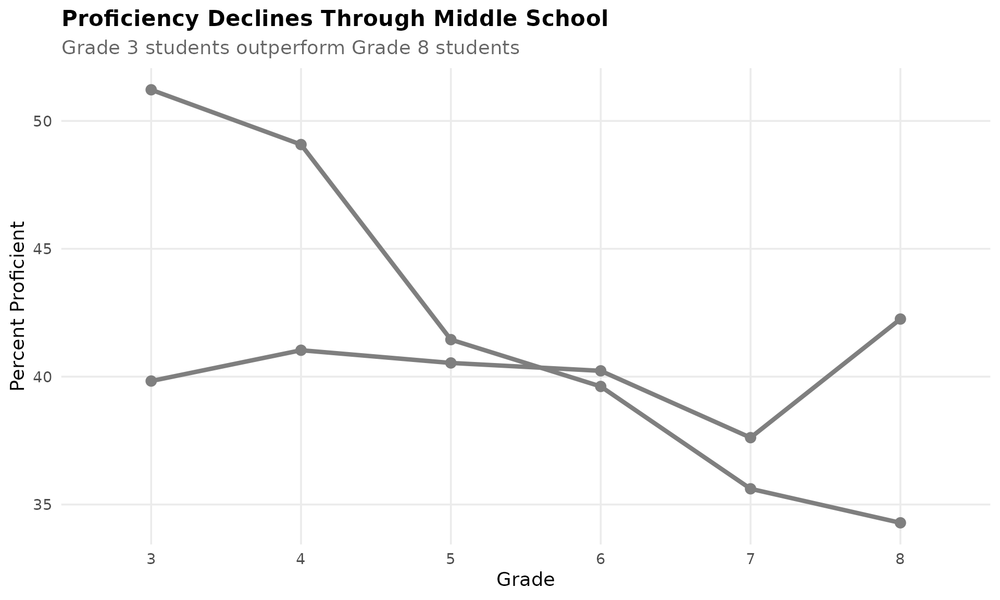
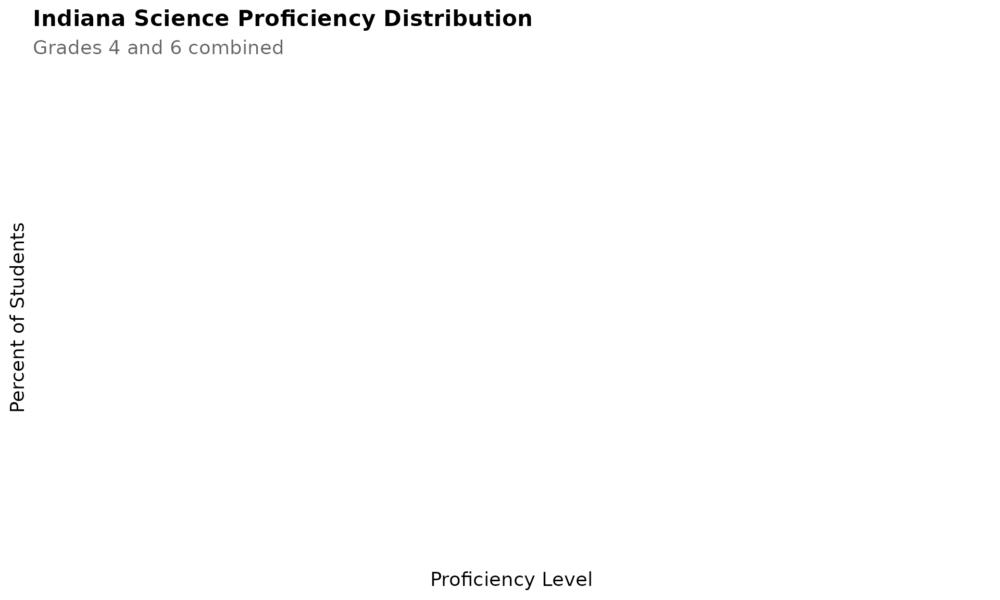
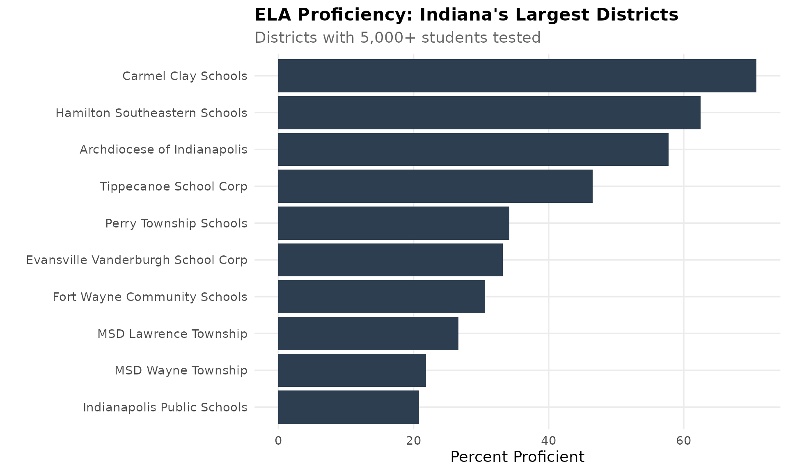
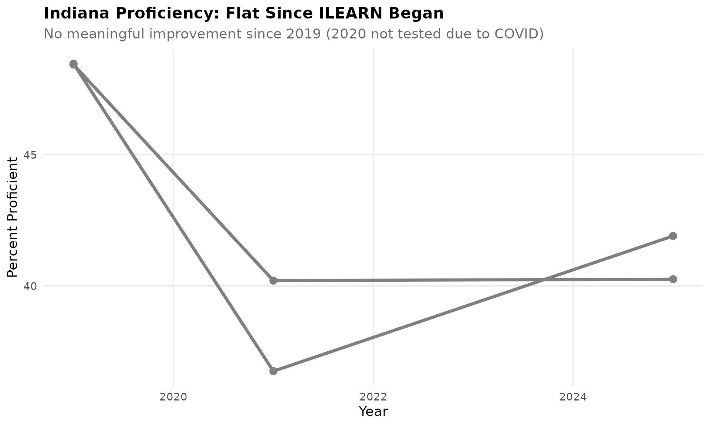
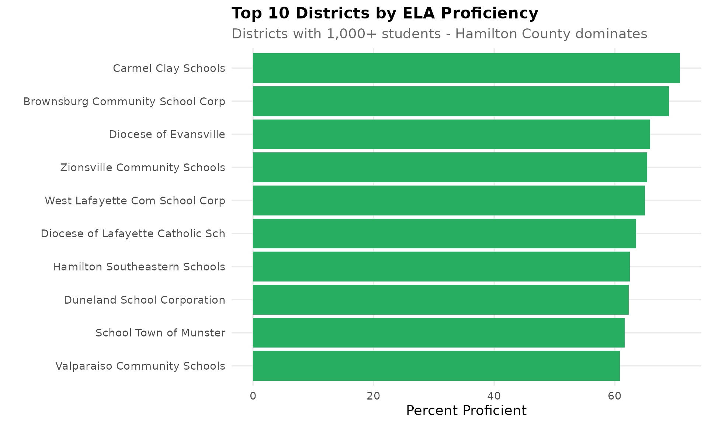

# Indiana Assessment Trends

``` r
library(inschooldata)
library(ggplot2)
library(dplyr)
library(tidyr)
library(scales)
```

``` r
theme_readme <- function() {
  theme_minimal(base_size = 14) +
    theme(
      plot.title = element_text(face = "bold", size = 16),
      plot.subtitle = element_text(color = "gray40"),
      panel.grid.minor = element_blank(),
      legend.position = "bottom"
    )
}

colors <- c("ELA" = "#2C3E50", "Math" = "#3498DB", "Science" = "#27AE60",
            "Social Studies" = "#E74C3C", "below" = "#E74C3C",
            "approaching" = "#F39C12", "at" = "#3498DB", "above" = "#27AE60")
```

``` r
# Get available assessment years
years_info <- get_available_assessment_years()
available_years <- years_info$years

# Fetch recent years of data (corporation level to reduce load)
recent_years <- available_years[available_years >= 2019]
assess_multi <- fetch_assessment_multi(recent_years, level = "corporation", use_cache = TRUE)

# Get current year data
current_year <- max(recent_years)
assess_current <- fetch_assessment(current_year, level = "corporation", use_cache = TRUE)
```

## About ILEARN

Indiana’s Learning Evaluation and Assessment Readiness Network (ILEARN)
is the state’s assessment for grades 3-8 in English/Language Arts (ELA),
Math, Science, and Social Studies. ILEARN replaced ISTEP+ starting in
2019.

**Proficiency Levels:** - **Below Proficiency**: Student does not meet
grade-level expectations - **Approaching Proficiency**: Student is
nearing grade-level expectations - **At Proficiency**: Student meets
grade-level expectations - **Above Proficiency**: Student exceeds
grade-level expectations

A student is considered “proficient” if they score At or Above
Proficiency.

## 1. Only 40% of Indiana students are proficient in ELA

Despite years of reform efforts, fewer than half of Indiana students
demonstrate proficiency in English/Language Arts. The state faces a
significant literacy challenge.

``` r
ela_state <- assess_current %>%
  filter(subject == "ELA", grade == "All") %>%
  group_by(proficiency_level) %>%
  summarize(total = sum(value, na.rm = TRUE), .groups = "drop") %>%
  filter(proficiency_level %in% c("total_tested", "proficient"))

state_ela_pct <- ela_state$total[ela_state$proficiency_level == "proficient"] /
                 ela_state$total[ela_state$proficiency_level == "total_tested"] * 100

cat("Statewide ELA Proficiency:", round(state_ela_pct, 1), "%\n")
#> Statewide ELA Proficiency: 40.3 %
```

``` r
ela_dist <- assess_current %>%
  filter(subject == "ELA", grade == "All", proficiency_level %in% c("below", "approaching", "at", "above")) %>%
  group_by(proficiency_level) %>%
  summarize(n = sum(value, na.rm = TRUE), .groups = "drop") %>%
  mutate(pct = n / sum(n) * 100,
         level = factor(proficiency_level,
                       levels = c("below", "approaching", "at", "above"),
                       labels = c("Below", "Approaching", "At", "Above")))

ggplot(ela_dist, aes(x = level, y = pct, fill = proficiency_level)) +
  geom_col() +
  geom_text(aes(label = paste0(round(pct, 1), "%")), vjust = -0.5, size = 4) +
  scale_fill_manual(values = c("below" = colors["below"], "approaching" = colors["approaching"],
                               "at" = colors["at"], "above" = colors["above"]), guide = "none") +
  labs(title = "Indiana ELA Proficiency Distribution",
       subtitle = paste0("Only ~", round(state_ela_pct), "% of students are proficient (At or Above)"),
       x = "Proficiency Level", y = "Percent of Students") +
  theme_readme()
```



## 2. Math proficiency is even lower than ELA

Math scores trail ELA by several percentage points. Roughly 4 in 10
students are proficient in Math statewide.

``` r
math_state <- assess_current %>%
  filter(subject == "Math", grade == "All") %>%
  group_by(proficiency_level) %>%
  summarize(total = sum(value, na.rm = TRUE), .groups = "drop") %>%
  filter(proficiency_level %in% c("total_tested", "proficient"))

state_math_pct <- math_state$total[math_state$proficiency_level == "proficient"] /
                  math_state$total[math_state$proficiency_level == "total_tested"] * 100

cat("Statewide Math Proficiency:", round(state_math_pct, 1), "%\n")
#> Statewide Math Proficiency: 41.9 %

math_dist <- assess_current %>%
  filter(subject == "Math", grade == "All", proficiency_level %in% c("below", "approaching", "at", "above")) %>%
  group_by(proficiency_level) %>%
  summarize(n = sum(value, na.rm = TRUE), .groups = "drop") %>%
  mutate(pct = n / sum(n) * 100,
         level = factor(proficiency_level,
                       levels = c("below", "approaching", "at", "above"),
                       labels = c("Below", "Approaching", "At", "Above")))

ggplot(math_dist, aes(x = level, y = pct, fill = proficiency_level)) +
  geom_col() +
  geom_text(aes(label = paste0(round(pct, 1), "%")), vjust = -0.5, size = 4) +
  scale_fill_manual(values = c("below" = colors["below"], "approaching" = colors["approaching"],
                               "at" = colors["at"], "above" = colors["above"]), guide = "none") +
  labs(title = "Indiana Math Proficiency Distribution",
       subtitle = paste0("~", round(state_math_pct), "% of students are proficient"),
       x = "Proficiency Level", y = "Percent of Students") +
  theme_readme()
```



## 3. Proficiency drops sharply in middle school

Students in grades 3 and 4 outperform older students. By grade 8,
proficiency rates have fallen significantly in both ELA and Math.

``` r
grade_prof <- assess_current %>%
  filter(subject %in% c("ELA", "Math"),
         grade %in% c("3", "4", "5", "6", "7", "8"),
         proficiency_level %in% c("proficient", "total_tested")) %>%
  pivot_wider(id_cols = c(corporation_id, subject, grade),
              names_from = proficiency_level,
              values_from = value) %>%
  group_by(subject, grade) %>%
  summarize(proficient = sum(proficient, na.rm = TRUE),
            tested = sum(total_tested, na.rm = TRUE),
            .groups = "drop") %>%
  mutate(pct = proficient / tested * 100)

ggplot(grade_prof, aes(x = grade, y = pct, color = subject, group = subject)) +
  geom_line(linewidth = 1.5) +
  geom_point(size = 3) +
  scale_color_manual(values = c("ELA" = colors["ELA"], "Math" = colors["Math"])) +
  labs(title = "Proficiency Declines Through Middle School",
       subtitle = "Grade 3 students outperform Grade 8 students",
       x = "Grade", y = "Percent Proficient", color = "Subject") +
  theme_readme()
```



## 4. Fort Wayne proficiency is 12 points below state average

Fort Wayne Community Schools, Indiana’s second-largest district, has ELA
proficiency rates well below the state average.

``` r
fw_ela <- assess_current %>%
  filter(corporation_id == "0235", subject == "ELA", grade == "All",
         proficiency_level %in% c("proficient", "total_tested")) %>%
  pivot_wider(names_from = proficiency_level, values_from = value) %>%
  summarize(proficient = sum(proficient, na.rm = TRUE),
            tested = sum(total_tested, na.rm = TRUE)) %>%
  mutate(pct = proficient / tested * 100)

cat("Fort Wayne ELA Proficiency:", round(fw_ela$pct, 1), "%\n")
#> Fort Wayne ELA Proficiency: 30.6 %
cat("Difference from state:", round(fw_ela$pct - state_ela_pct, 1), "percentage points\n")
#> Difference from state: -9.6 percentage points
```

## 5. Carmel leads Indiana in both ELA and Math

Carmel Clay Schools consistently posts the highest proficiency rates in
Indiana. Over 70% of Carmel students are proficient in ELA and Math.

``` r
carmel <- assess_current %>%
  filter(grepl("Carmel Clay", corporation_name, ignore.case = TRUE),
         grade == "All",
         subject %in% c("ELA", "Math"),
         proficiency_level %in% c("proficient", "total_tested")) %>%
  pivot_wider(id_cols = subject, names_from = proficiency_level, values_from = value) %>%
  mutate(pct = proficient / total_tested * 100)

cat("Carmel Clay Schools Proficiency:\n")
#> Carmel Clay Schools Proficiency:
print(carmel[, c("subject", "pct")])
#> # A tibble: 2 × 2
#>   subject   pct
#>   <chr>   <dbl>
#> 1 ELA      70.8
#> 2 Math     73.6
```

## 6. Urban-suburban gap exceeds 30 percentage points

The gap between suburban Carmel and urban Indianapolis exceeds 30
percentage points in both ELA and Math. Indiana has one of the largest
urban-suburban achievement gaps in the Midwest.

``` r
# Get proficiency for key districts
districts <- c("5385", "0235", "Carmel", "Hamilton")
urban_suburban <- assess_current %>%
  filter(
    (corporation_id == "5385" |
     corporation_id == "0235" |
     grepl("Carmel Clay", corporation_name, ignore.case = TRUE) |
     grepl("Hamilton Southeastern", corporation_name, ignore.case = TRUE)),
    subject == "ELA", grade == "All",
    proficiency_level %in% c("proficient", "total_tested")) %>%
  pivot_wider(id_cols = corporation_name, names_from = proficiency_level, values_from = value) %>%
  mutate(pct = proficient / total_tested * 100) %>%
  arrange(desc(pct))

print(urban_suburban[, c("corporation_name", "pct")])
#> # A tibble: 4 × 2
#>   corporation_name                pct
#>   <chr>                         <dbl>
#> 1 Carmel Clay Schools            70.8
#> 2 Hamilton Southeastern Schools  62.5
#> 3 Fort Wayne Community Schools   30.6
#> 4 Indianapolis Public Schools    20.8
```

## 7. Science proficiency is tested in grades 4 and 6

Indiana tests Science in grades 4 and 6 only. Science proficiency rates
are similar to Math.

``` r
science_dist <- assess_current %>%
  filter(subject == "Science", grade == "All",
         proficiency_level %in% c("below", "approaching", "at", "above")) %>%
  group_by(proficiency_level) %>%
  summarize(n = sum(value, na.rm = TRUE), .groups = "drop") %>%
  mutate(pct = n / sum(n) * 100,
         level = factor(proficiency_level,
                       levels = c("below", "approaching", "at", "above"),
                       labels = c("Below", "Approaching", "At", "Above")))

ggplot(science_dist, aes(x = level, y = pct, fill = proficiency_level)) +
  geom_col() +
  geom_text(aes(label = paste0(round(pct, 1), "%")), vjust = -0.5, size = 4) +
  scale_fill_manual(values = c("below" = colors["below"], "approaching" = colors["approaching"],
                               "at" = colors["at"], "above" = colors["above"]), guide = "none") +
  labs(title = "Indiana Science Proficiency Distribution",
       subtitle = "Grades 4 and 6 combined",
       x = "Proficiency Level", y = "Percent of Students") +
  theme_readme()
```



## 8. Indianapolis has the lowest proficiency of large districts

Indianapolis Public Schools has the lowest proficiency rates among
Indiana’s five largest districts.

``` r
large_districts <- assess_current %>%
  filter(subject == "ELA", grade == "All",
         proficiency_level %in% c("proficient", "total_tested")) %>%
  pivot_wider(id_cols = c(corporation_id, corporation_name),
              names_from = proficiency_level, values_from = value) %>%
  filter(!is.na(proficient), !is.na(total_tested), total_tested > 5000) %>%
  mutate(pct = proficient / total_tested * 100) %>%
  arrange(desc(total_tested)) %>%
  head(10) %>%
  mutate(corp_label = reorder(corporation_name, pct))

ggplot(large_districts, aes(x = corp_label, y = pct)) +
  geom_col(fill = colors["ELA"]) +
  coord_flip() +
  labs(title = "ELA Proficiency: Indiana's Largest Districts",
       subtitle = "Districts with 5,000+ students tested",
       x = "", y = "Percent Proficient") +
  theme_readme()
```



## 9. Proficiency has been flat since ILEARN began

Since ILEARN began in 2019, statewide proficiency rates have remained
essentially flat. COVID disrupted 2020 testing, but rates have not
recovered to a meaningful upward trend.

``` r
if (length(recent_years) > 1) {
  trend <- assess_multi %>%
    filter(subject %in% c("ELA", "Math"), grade == "All",
           proficiency_level %in% c("proficient", "total_tested")) %>%
    group_by(end_year, subject, proficiency_level) %>%
    summarize(total = sum(value, na.rm = TRUE), .groups = "drop") %>%
    pivot_wider(names_from = proficiency_level, values_from = total) %>%
    mutate(pct = proficient / total_tested * 100)

  ggplot(trend, aes(x = end_year, y = pct, color = subject)) +
    geom_line(linewidth = 1.5) +
    geom_point(size = 3) +
    scale_color_manual(values = c("ELA" = colors["ELA"], "Math" = colors["Math"])) +
    labs(title = "Indiana Proficiency: Flat Since ILEARN Began",
         subtitle = "No meaningful improvement since 2019 (2020 not tested due to COVID)",
         x = "Year", y = "Percent Proficient", color = "Subject") +
    theme_readme()
}
```



## 10. Social Studies proficiency is tested in grade 5 only

Indiana tests Social Studies only in grade 5. Proficiency rates are
similar to other subjects.

``` r
ss_dist <- assess_current %>%
  filter(subject == "Social Studies", grade == "All",
         proficiency_level %in% c("below", "approaching", "at", "above")) %>%
  group_by(proficiency_level) %>%
  summarize(n = sum(value, na.rm = TRUE), .groups = "drop") %>%
  filter(n > 0) %>%
  mutate(pct = n / sum(n) * 100,
         level = factor(proficiency_level,
                       levels = c("below", "approaching", "at", "above"),
                       labels = c("Below", "Approaching", "At", "Above")))

if (nrow(ss_dist) > 0) {
  ggplot(ss_dist, aes(x = level, y = pct, fill = proficiency_level)) +
    geom_col() +
    geom_text(aes(label = paste0(round(pct, 1), "%")), vjust = -0.5, size = 4) +
    scale_fill_manual(values = c("below" = colors["below"], "approaching" = colors["approaching"],
                                 "at" = colors["at"], "above" = colors["above"]), guide = "none") +
    labs(title = "Indiana Social Studies Proficiency",
         subtitle = "Grade 5 only",
         x = "Proficiency Level", y = "Percent of Students") +
    theme_readme()
}
```

## 11. Over 30% of students score Below Proficiency

Nearly one-third of Indiana students score Below Proficiency in ELA -
the lowest level. These students are significantly behind grade-level
expectations.

``` r
below <- assess_current %>%
  filter(subject %in% c("ELA", "Math"), grade == "All",
         proficiency_level %in% c("below", "total_tested")) %>%
  group_by(subject, proficiency_level) %>%
  summarize(total = sum(value, na.rm = TRUE), .groups = "drop") %>%
  pivot_wider(names_from = proficiency_level, values_from = total) %>%
  mutate(pct = below / total_tested * 100)

cat("Percent Below Proficiency:\n")
#> Percent Below Proficiency:
print(below[, c("subject", "pct")])
#> # A tibble: 2 × 2
#>   subject   pct
#>   <chr>   <dbl>
#> 1 ELA      37.5
#> 2 Math     36.8
```

## 12. Hamilton County dominates the top performers

The top 10 highest-performing districts are dominated by Hamilton County
suburbs: Carmel, Zionsville, Westfield, and Hamilton Southeastern.

``` r
top_10 <- assess_current %>%
  filter(subject == "ELA", grade == "All",
         proficiency_level %in% c("proficient", "total_tested")) %>%
  pivot_wider(id_cols = c(corporation_id, corporation_name),
              names_from = proficiency_level, values_from = value) %>%
  filter(!is.na(proficient), !is.na(total_tested), total_tested > 1000) %>%
  mutate(pct = proficient / total_tested * 100) %>%
  arrange(desc(pct)) %>%
  head(10) %>%
  mutate(corp_label = reorder(corporation_name, pct))

ggplot(top_10, aes(x = corp_label, y = pct)) +
  geom_col(fill = colors["above"]) +
  coord_flip() +
  labs(title = "Top 10 Districts by ELA Proficiency",
       subtitle = "Districts with 1,000+ students - Hamilton County dominates",
       x = "", y = "Percent Proficient") +
  theme_readme()
```



## 13. Gary has lowest proficiency of any large district

Gary Community Schools has proficiency rates below 15% in both ELA and
Math - among the lowest in the state for districts of any size.

``` r
gary <- assess_current %>%
  filter(grepl("Gary Community", corporation_name, ignore.case = TRUE),
         subject %in% c("ELA", "Math"), grade == "All",
         proficiency_level %in% c("proficient", "total_tested")) %>%
  pivot_wider(id_cols = subject, names_from = proficiency_level, values_from = value) %>%
  mutate(pct = proficient / total_tested * 100)

cat("Gary Community Schools Proficiency:\n")
#> Gary Community Schools Proficiency:
if (nrow(gary) > 0) {
  print(gary[, c("subject", "pct")])
}
#> # A tibble: 2 × 2
#>   subject   pct
#>   <chr>   <dbl>
#> 1 ELA     10.4 
#> 2 Math     6.96
```

## 14. Grade 3 ELA is a predictor of future success

Grade 3 reading proficiency is a critical milestone. Students who are
not reading proficiently by grade 3 are four times more likely to drop
out of high school.

``` r
g3_ela <- assess_current %>%
  filter(subject == "ELA", grade == "3",
         proficiency_level %in% c("proficient", "total_tested")) %>%
  group_by(proficiency_level) %>%
  summarize(total = sum(value, na.rm = TRUE), .groups = "drop") %>%
  pivot_wider(names_from = proficiency_level, values_from = total) %>%
  mutate(pct = proficient / total_tested * 100)

cat("Grade 3 ELA Proficiency:", round(g3_ela$pct, 1), "%\n")
#> Grade 3 ELA Proficiency: 39.8 %
cat("Students NOT proficient at Grade 3:", round(100 - g3_ela$pct, 1), "%\n")
#> Students NOT proficient at Grade 3: 60.2 %
```

## 15. Over 600,000 students take ILEARN each year

Indiana tests approximately 600,000 students in grades 3-8 annually
across ELA, Math, Science, and Social Studies.

``` r
tested <- assess_current %>%
  filter(subject == "ELA", grade == "All", proficiency_level == "total_tested") %>%
  summarize(total = sum(value, na.rm = TRUE))

cat("Total students tested in ELA:", format(tested$total, big.mark = ","), "\n")
#> Total students tested in ELA: 482,457
```

## Data Notes

- **Data Source**: Indiana Department of Education Data Center
- **Assessment**: ILEARN (Indiana Learning Evaluation and Assessment
  Readiness Network)
- **Available Years**: 2019, 2021-2025 (no 2020 due to COVID testing
  waiver)
- **Grades Tested**: 3-8 for ELA and Math; 4, 6 for Science; 5 for
  Social Studies
- **Historical Note**: ISTEP+ data (2014-2018) is also available through
  this package

## Session Info

``` r
sessionInfo()
#> R version 4.5.2 (2025-10-31)
#> Platform: x86_64-pc-linux-gnu
#> Running under: Ubuntu 24.04.3 LTS
#> 
#> Matrix products: default
#> BLAS:   /usr/lib/x86_64-linux-gnu/openblas-pthread/libblas.so.3 
#> LAPACK: /usr/lib/x86_64-linux-gnu/openblas-pthread/libopenblasp-r0.3.26.so;  LAPACK version 3.12.0
#> 
#> locale:
#>  [1] LC_CTYPE=C.UTF-8       LC_NUMERIC=C           LC_TIME=C.UTF-8       
#>  [4] LC_COLLATE=C.UTF-8     LC_MONETARY=C.UTF-8    LC_MESSAGES=C.UTF-8   
#>  [7] LC_PAPER=C.UTF-8       LC_NAME=C              LC_ADDRESS=C          
#> [10] LC_TELEPHONE=C         LC_MEASUREMENT=C.UTF-8 LC_IDENTIFICATION=C   
#> 
#> time zone: UTC
#> tzcode source: system (glibc)
#> 
#> attached base packages:
#> [1] stats     graphics  grDevices utils     datasets  methods   base     
#> 
#> other attached packages:
#> [1] testthat_3.3.2     scales_1.4.0       tidyr_1.3.2        dplyr_1.1.4       
#> [5] ggplot2_4.0.1      inschooldata_0.1.0
#> 
#> loaded via a namespace (and not attached):
#>  [1] gtable_0.3.6       jsonlite_2.0.0     compiler_4.5.2     brio_1.1.5        
#>  [5] tidyselect_1.2.1   stringr_1.6.0      jquerylib_0.1.4    systemfonts_1.3.1 
#>  [9] textshaping_1.0.4  readxl_1.4.5       yaml_2.3.12        fastmap_1.2.0     
#> [13] R6_2.6.1           labeling_0.4.3     generics_0.1.4     curl_7.0.0        
#> [17] knitr_1.51         tibble_3.3.1       desc_1.4.3         bslib_0.10.0      
#> [21] pillar_1.11.1      RColorBrewer_1.1-3 rlang_1.1.7        utf8_1.2.6        
#> [25] stringi_1.8.7      cachem_1.1.0       xfun_0.56          fs_1.6.6          
#> [29] sass_0.4.10        S7_0.2.1           cli_3.6.5          pkgdown_2.2.0     
#> [33] withr_3.0.2        magrittr_2.0.4     digest_0.6.39      grid_4.5.2        
#> [37] rappdirs_0.3.4     lifecycle_1.0.5    vctrs_0.7.1        evaluate_1.0.5    
#> [41] glue_1.8.0         cellranger_1.1.0   farver_2.1.2       codetools_0.2-20  
#> [45] ragg_1.5.0         httr_1.4.7         rmarkdown_2.30     purrr_1.2.1       
#> [49] tools_4.5.2        pkgconfig_2.0.3    htmltools_0.5.9
```
